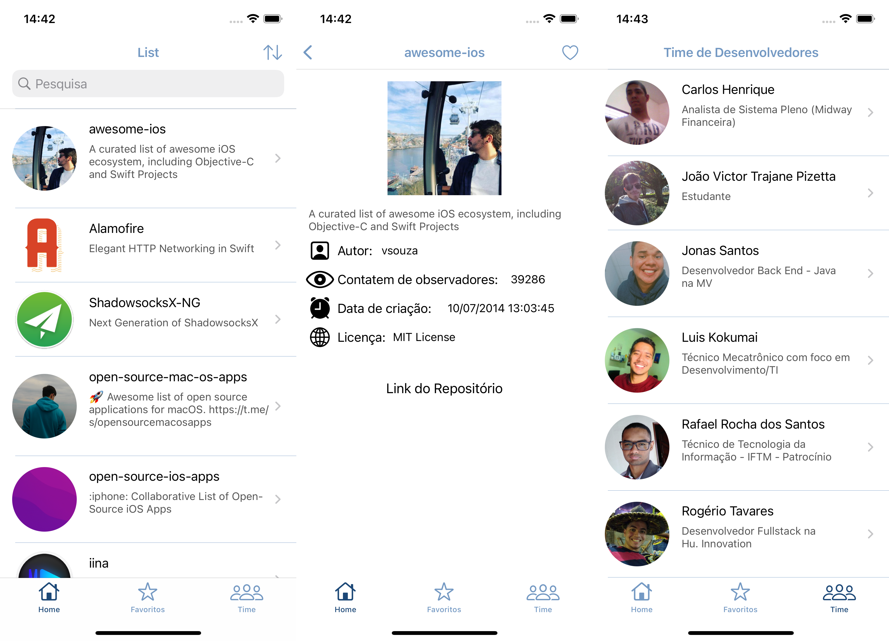

# Projeto final Go!dev

## Sobre o projeto
Este projeto tem como objetivo buscar, listar, ordernar por classifação de estrelas os repositórios relacionado a linguagem de programação, o mesmo tem ainda como objetivo favoritar o repositório que o usuário selecionou e também é possível visualizar uma lista de todos os repositórios selecionados.'
Nesta aplicação foi utilizada a arquitetura MVC, que é uma das arquiteturas mais usadas no mercado de desenvolvimento.

## Telas da aplicação

## Rodar a aplicação
Ao baixar ou fazer clone da aplicação para abrir é necessario acessar a pasta a aplicação e clicar no arquivo: `godev_projeto_final.xcworkspace` para que abra o projeto e possa rodar os pods que foram configurado para a aplicação. Caso for abrir pelo XCode também entrar na pasta e buscar pelo arquivo citado anteriormente.
## Telas
O projeto conta com 5 telas sendo elas:
* Home que lista os repositórios que é buscado através da api do Github;
* Detalhe do respositório;
* Tela de respositórios favoritados;
* Tela do Time que desenvolveu a aplicação;
* Tela de Detalhe do desenvolvedor.

## Tecnologias utilizadas
* Swift 5
* XCode 13.2.1
* View code
* Core data
* Kingfisher

## Instalação das dependências
* pod install

## Futuras atualizações
* Aplicar a arquitetura MVVM
* Coordinator
* Atualizações de layout

## Desenvolvedores

<table>
  <tr>
    <td align="center">
      <a href="https://www.linkedin.com/in/carlos-henrique-pires-dos-santos-23251a122/">
         
        <b>Carlos Henrique</b>
      </a>
    </td>
    <td align="center">
      <a href="https://www.linkedin.com/in/jvictor-pizetta/">
         
        <b>João Victor</b>
      </a>
    </td>
        <td align="center">
      <a href="https://www.linkedin.com/in/jonas-william-a882971a4">
         
        <b>Jonas Santos</b>
      </a>
    </td>
        <td align="center">
      <a href="https://www.linkedin.com/in/luiskokumai/">
         
        <b>Luis Kokumai</b>
      </a>
    </td>
        <td align="center">
      <a href="https://www.linkedin.com/in/rafael-rocha-dos-santos-7b133410b">
         
        <b>Rafael Rocha</b>
      </a>
    </td>
    </td>
        <td align="center">
      <a href="https://www.linkedin.com/in/rogertavaress">
         
        <b>Rogério Tavares</b>
      </a>
    </td>
  </tr>
</table>